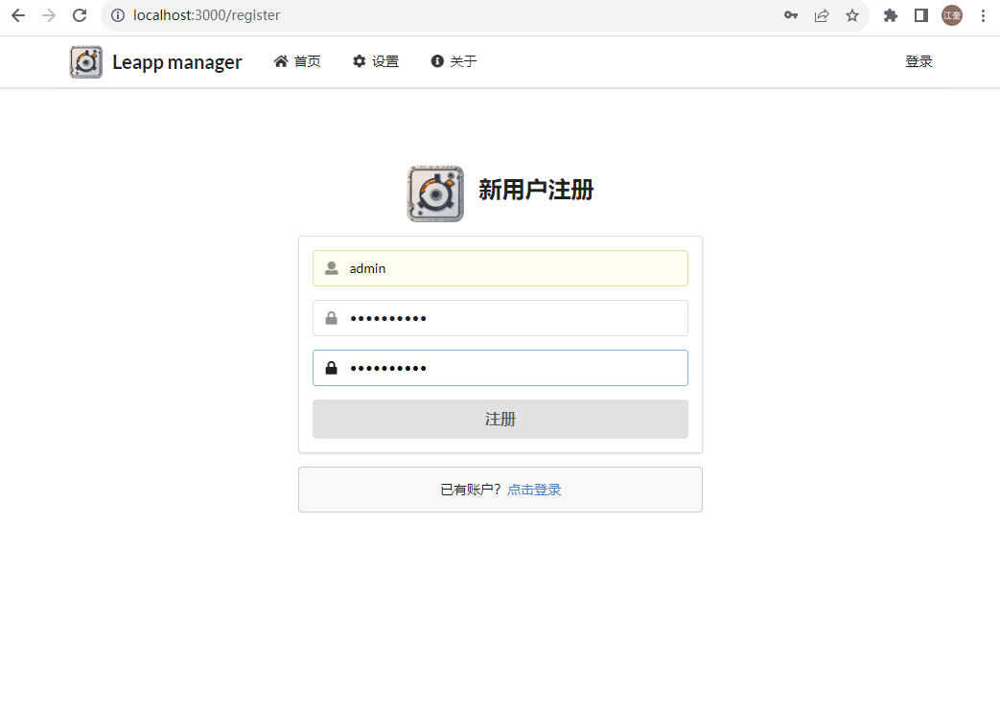
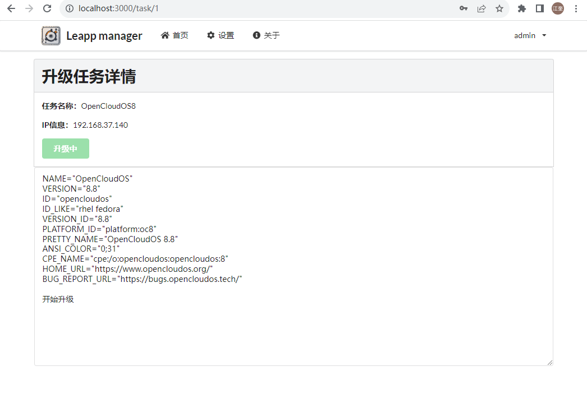

# leapp-manager

leapp-manager 是一个 Web 管理系统，基于开源项目 gin-template (https://github.com/songquanpeng/gin-template) 进一步开发，用于管理升级任务。在某个机器上部署该系统后，就可以通过浏览器创建和管理升级任务。

后端使用 Gin、Gorm 框架，前端使用 React 进行开发，使用 WebSocket 实时获取升级日志。使用以下命令一键部署：

```bash
docker compose up
```

主要功能：

1. 服务端响应 Web 请求，用户通过浏览器与服务器进行交互，包括升级指令发出、升级状况的实时显示。
2. 用户选择升级的机器 IP 后，服务器使用 SSH 登录到待升级机器（可能有多台）安装升级工具，并开始运行。升级工具已经被打包为 rpm 包，输出到标准输出和日志中。
3. 服务器实时显示待升级机器的升级进度，用户可以通过浏览器实时看到可视化处理后的结果。

## 升级步骤

服务端部署leapp-manager后，浏览器访问web系统


创建账户并登录




创建升级任务


查看升级任务并开始升级



查看后台进程发现leapp已经开始运行：

```shell
[root@localhost ~]# ps aux | grep leapp
root       83584 22.4  0.8 341476 33536 pts/1    S+   14:55   0:03 /usr/libexec/platform-python /usr/bin/leapp upgrade --reboot
root       83981  0.7  0.6 488808 26728 pts/1    Sl+  14:55   0:00 /usr/libexec/platform-python /usr/bin/leapp upgrade --reboot
root       84173  0.5  0.7 489196 27204 pts/1    Sl+  14:55   0:00 /usr/libexec/platform-python /usr/bin/leapp upgrade --reboot
root       84207 92.5  0.7 341908 29216 pts/1    R+   14:55   0:06 /usr/libexec/platform-python /usr/bin/leapp upgrade --reboot
root       84218  0.0  0.0 221940  1100 pts/2    R+   14:55   0:00 grep --color=auto leapp
```

耐心等待系统升级结束，需要10-20min左右，如果系统中软件包较多耗时可能较长。升级过程中系统会自动重启两次，SSH终端等会暂时断开

## FAQ

1. 在升级过程中，遇到如下报错：

   ```shell
   Process Process-448:
   Traceback (most recent call last):
     File "/usr/lib/python3.6/site-packages/leapp/libraries/stdlib/__init__.py", line 185, in run
       stdin=stdin, env=env, encoding=encoding)
     File "/usr/lib/python3.6/site-packages/leapp/libraries/stdlib/call.py", line 155, in _call
       stderr, wstderr = os.pipe()
   OSError: [Errno 24] Too many open files
   ```

   原因是默认文件描述符数量上限太小，不能满足升级要求 。可以手动调整文件描述符上限解决：

   ```shell
   ulimit -n 375932
   ```

   

## 许可证

本项目采用 MIT许可证。详情请参阅 [LICENSE](./LICENSE) 文件。